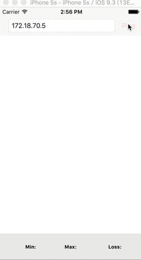

### SRPingHelper

----------
An encapsulation of Apple's SimplePing, support RTT and packetsloss result.



#### Features
1. Apple's SimplePing has update to support IPv6 network.
2. RTT and packetsloss.
3. Ping timeout set to 1.5s.

```
      // ADD
      // Send Timeout:1.5s
        CFSocketNativeHandle sock = CFSocketGetNative(self->_socket);
        struct timeval tv;
        tv.tv_sec = 1;
        tv.tv_usec = 500000;
        setsockopt(sock, SOL_SOCKET, SO_SNDTIMEO, (void *)&tv, sizeof(tv));
        // end Add
        
        bytesSent = sendto(
            sock,
            packet.bytes,
            packet.length, 
            0,
            self.hostAddress.bytes, 
            (socklen_t) self.hostAddress.length
        );
```

#### How to use

1. import "SRPingHelper.h" 
2. Implement  SRPingHelperDelegate delegate method.
3. See demo.

#### Installation

```
Drag the floder SRPingHepler to your project.
Import the main header file：#import "SRPingHepler.h"

```

#### Contact
If you have any question, send email to <qqingweihao@163.com>


